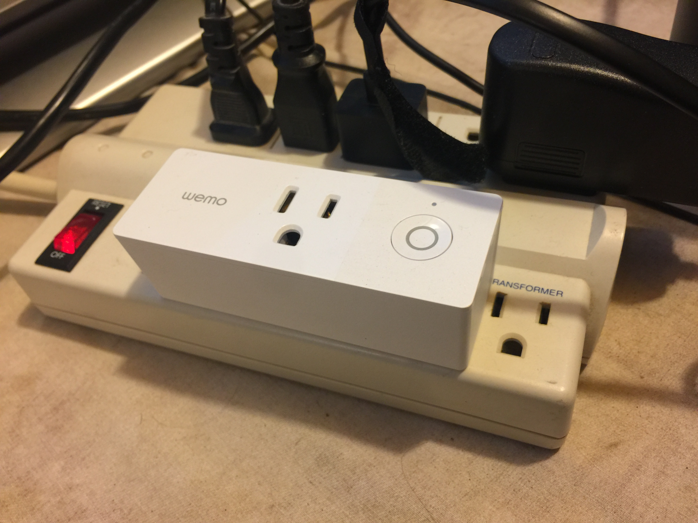

# bot-wemo
Control Wemo switch using Bitcoin.

There is a lot going on even in this simple example.

## A word on hardware oracles and agents
Events on the Bitcoin ledger cannot control real-world devices without some "controller" or agent. This agent is also known as an oracle so I will use the terms synonymously. An agent is simply a piece of software that does what it is told. A hardware oracle is simply an agent that runs outside bitcoin and controls or responds to a hardware device.

## A word on agent responsibilities
Even though this is an extremely simple example of controlling a device through bitcoin, it still demonstrates some important principles of agent design.

Note that the switch has a manual override button to turn the switch on or off. In other words, a button in real life must override whatever bitcoin says is the current state of the device. Therefore, our agent must update bitcoin whenever the switch is pressed on the device.
* The agent observes bitcoin by listening to the BOT service and turns the switch on or off.
* The agent observes the device and updates bitcoin whenever the device is manually changed.
* Bitcoin is the system of record for the state of the device. When the agent "wakes up" it should set the state of the device to whatever bitcoin reports as the last known state of the device.
